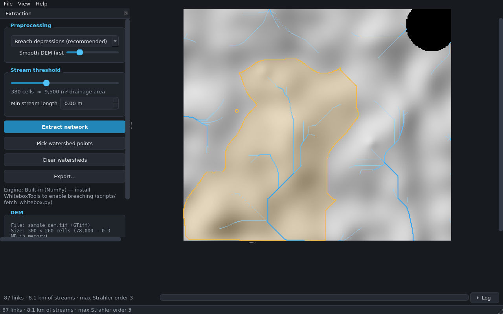

# Drainage Network Extractor

[](https://github.com/renmurry/DrainageExtractor25/actions/workflows/ci.yml)
[](https://github.com/renmurry/DrainageExtractor25/releases)
[](LICENSE)
[](pyproject.toml)

A desktop app that turns a digital elevation model into a vector drainage
network: streams with Strahler orders, lengths and upstream areas, plus
click-to-delineate watersheds — exported to GIS and CAD formats.

Built on **WhiteboxTools** for hydrology, **rasterio / pyproj / GeoPandas**
for I/O, and **PySide6** for the interface. No GDAL command-line tools, no
ArcGIS/QGIS required.

## Screenshots



*More screenshots (export dialog, geographic-CRS prompt) — coming soon.*

## Features

- **Any DEM** — GeoTIFF, ERDAS Imagine (.img) or ESRI ASCII (.asc), any
  resolution. Validation on load reports CRS, resolution, nodata, size and
  elevation range in plain language.
- **Geographic CRS guard** — DEMs in degrees are detected and the app offers
  one-click reprojection to the UTM zone under the DEM's centroid before any
  hydrology runs.
- **Preprocessing your way** — least-cost depression breaching (default,
  via WhiteboxTools) or classic sink filling, plus optional
  feature-preserving smoothing for noisy lidar surfaces.
- **The full pipeline** — D8 flow directions → flow accumulation →
  threshold-based stream extraction (threshold auto-suggested from DEM
  statistics, adjustable on a log slider) → Strahler ordering →
  vectorization with `order`, `length_m`, `upstream_area_m2` attributes and
  optional pruning of short first-order fingers.
- **Watersheds** — toggle pick mode, click the map; the pour point snaps to
  the strongest nearby flow line and the upstream catchment is delineated
  and measured.
- **Exports** — GeoPackage (default), Shapefile, GeoJSON, KML/KMZ (styled by
  stream order), AutoCAD DXF (one layer per order), each with EPSG
  code/name search and on-export reprojection; optional conditioned-DEM,
  flow-accumulation and hillshade GeoTIFFs.
- **Never freezes** — all processing runs on worker threads with staged
  progress ("Breaching depressions — water always finds a way") and a Cancel
  button that actually cancels, killing the engine mid-tool if needed.
- **Robust by default** — memory budgeting before heavy runs, block-streamed
  raster I/O for large files, friendly error dialogs with technical details
  on demand, rotating log files.
- **Works without WhiteboxTools too** — a built-in NumPy engine (filling,
  D8, accumulation) keeps everything functional; the app tells you when it's
  in fallback mode and breaching becomes filling with a logged warning.

## Quickstart

```bash
git clone https://github.com/renmurry/DrainageExtractor25.git
cd DrainageExtractor25
python -m venv .venv && . .venv/bin/activate    # Windows: .venv\Scripts\activate
pip install -e .

# recommended: fetch the WhiteboxTools binary (~10 MB) for fast hydrology + breaching
python scripts/fetch_whitebox.py

drainage-extractor                # or: python -m drainage_extractor
```

Then drop `examples/sample_dem.tif` onto the window, click **Extract
network**, and **Export…** it as a GeoPackage.

Open a DEM straight from the command line:

```bash
drainage-extractor path/to/dem.tif
```

## Using the pipeline from Python

```python
from drainage_extractor.core.pipeline import PipelineParams, run_pipeline
from drainage_extractor.core.exports import export_vector_layers

result = run_pipeline(
    "examples/sample_dem.tif",
    PipelineParams(preprocess="breach", min_stream_length_m=25.0),
)
print(result.streams[["order", "length_m", "upstream_area_km2"]].head())
export_vector_layers({"streams": result.streams}, "network.gpkg", "gpkg")
```

## Export formats

| Format | Notes |
|---|---|
| GeoPackage (`.gpkg`) | Default. Streams + watersheds as layers in one file, any CRS. |
| Shapefile (`.shp`) | One file per layer; long field names shortened for DBF (`uparea_m2`). |
| GeoJSON (`.geojson`) | Always WGS 84, per the spec. |
| KML / KMZ | Always WGS 84; lines styled and widened by Strahler order. |
| DXF (`.dxf`) | R2010; `STREAMS_ORDER_n` layers; coordinates in the chosen CRS (DXF stores no CRS). |
| GeoTIFF add-ons | Conditioned DEM, flow accumulation, hillshade — reprojected on request. |

## The hydrology engine

The app looks for a WhiteboxTools executable in this order: the
`DRAINAGE_EXTRACTOR_WBT` environment variable → the PyInstaller bundle →
`src/drainage_extractor/bin/` (where `scripts/fetch_whitebox.py` puts it) →
`PATH` → the `whitebox` pip package. If none is found it switches to the
built-in NumPy engine — correct, but slower on big rasters and without
least-cost breaching.

## Large DEMs

Reprojection, format conversion and raster exports stream block-by-block, so
they are bounded by disk, not RAM. The flow-network stages need the grids in
memory (that's inherent to global hydrology); the app estimates the
requirement up front against available RAM and refuses early — with the
numbers and suggestions — rather than dying mid-run. As a rule of thumb, a
10 000 × 10 000 DEM wants ~6–8 GB free with the built-in engine; WhiteboxTools
is leaner and considerably faster.

## Building the Windows exe

```bash
pip install -e .[dev]
python scripts/fetch_whitebox.py        # bundle the engine into the exe
pyinstaller DrainageExtractor.spec --noconfirm
# → dist/DrainageExtractor.exe  (one file, windowed, icon + WhiteboxTools inside)
```

Tagged releases build themselves: push a `v*` tag (e.g. `v1.0.0`) and the
[Release workflow](.github/workflows/release.yml) compiles the exe and
attaches it to the GitHub Release.

## Development

```bash
pip install -e .[dev]
pytest            # full suite, includes an end-to-end run on examples/sample_dem.tif
ruff check src tests
```

The sample DEM is deterministic — regenerate it with
`python examples/make_sample_dem.py`. WhiteboxTools-specific tests skip
automatically when the binary is absent.

## Repository layout

```
src/drainage_extractor/
  core/        DEM I/O, engines (WhiteboxTools + NumPy fallback),
               streams/Strahler, watersheds, exports, pipeline
  gui/         PySide6 app: canvas, panels, dialogs, workers, theme, icons
  utils/       logging setup
examples/      sample_dem.tif + generator
scripts/       fetch_whitebox.py, make_icon.py
tests/         pytest suite (pipeline, exports, GUI smoke)
```

## License

[MIT](LICENSE) © 2026 Ren Murry.
Hydrology powered by [WhiteboxTools](https://www.whiteboxgeo.com/) (MIT) —
thank you, Prof. John Lindsay and the Whitebox Geospatial community.
